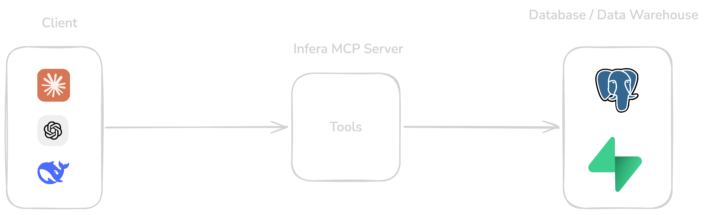

# infera-mcp-server

Lets an AI assistant like Claude or ChatGPT access your company's internal database and give you insights — with controlled access, only to what it needs. Ask it a question, and it can pull the numbers, then build a chart or a written analysis out of them itself.

## Architecture



## Company records it can pull up

- **Customers** — who they are, when they joined, and whether they're active, churned, or a prospect.
- **Subscriptions & plans** — what each customer is subscribed to, and every upgrade, downgrade, or cancellation along the way.
- **Sales deals** — every closed deal, won or lost.
- **Sales pipeline** — every open opportunity still being worked.

## Connecting Claude

The server is live at:

```
https://infera-mcp-server.vercel.app
```

**Claude.ai / Claude Desktop** — Settings → Connectors → Add custom connector → paste the URL above → Add. Claude redirects you to log in or sign up (this connects through [infera-ui](https://infera-ui.vercel.app), the account/consent screen), then asks you to approve access. Once approved, the connector's ready to use.

## Available MCP tools

| Tool | What it does |
|---|---|
| `get_business_summary` | Gives a quick health check of the business — revenue, customers, churn, and sales in one snapshot. |
| `compare_periods` | Compares how the business performed between two time periods, side by side. |
| `get_revenue_metrics` | Shows recurring revenue and where the growth or loss came from. |
| `get_revenue_trend` | Tracks recurring revenue over time — by day, month, or quarter. |
| `get_revenue_breakdown` | Shows which customers, plans, or products are driving the most revenue. |
| `get_customer_metrics` | Counts customers gained, lost, and kept, plus overall growth rate. |
| `get_top_customers` | Lists the biggest customers, ranked by how much they pay. |
| `get_subscription_metrics` | Tracks subscription activity — new signups, upgrades, downgrades, cancellations. |
| `get_churn_metrics` | Measures how much revenue and how many customers are being lost, and how well existing ones are retained. |
| `get_sales_metrics` | Summarizes closed deals — how many were won or lost, and how big they were on average. |
| `get_sales_pipeline` | Shows what deals are still open and roughly how much they could be worth. |

## Try it with Claude

Paste these into Claude (connected to this MCP server) to pull real data and turn it into a chart or a written insight. Claude calls the tools above, then builds the visual or analysis itself — the server hands back raw numbers, not images.

**Revenue & trends**
- "Show me a monthly MRR trend chart for all of 2024, and call out any months where growth stalled."
- "Create a trend visual for our sales performance in Q4 2024 — closed revenue, win rate, and average deal size."

**Customers**
- "Who are our top 10 customers by revenue, and which ones look at risk of churning?"
- "How many customers did we gain and lose this quarter, and what's our net growth rate?"

**Pipeline & sales**
- "How much revenue is sitting in our open pipeline right now, and how likely is it to close?"
- "What's our win rate this quarter, and how does it compare to last quarter?"

**Multi-tool insight** — Claude pulls from several tools and compiles the results itself into one answer:
- "Give me a full Q4 2024 business review — revenue growth, churn, and sales performance — summarized like a one-page report for my board."
- "Compare Q3 vs Q4 2024 across revenue, customers, and sales, and tell me if we're accelerating or slowing down."
